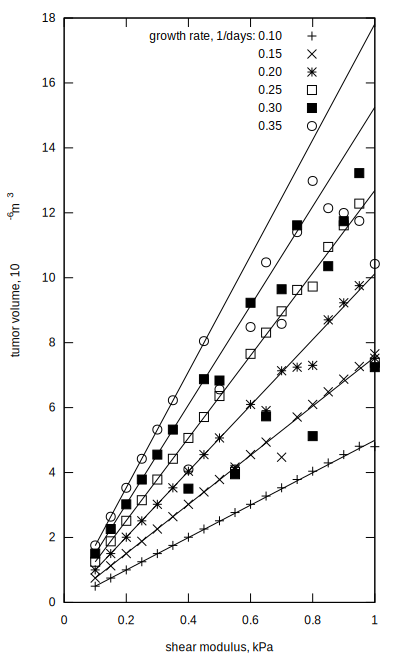

<p align="center"></p>

## Getting started
To run Msolve and
[korali](https://www.cse-lab.ethz.ch/korali)
integration example use the
[docker image](Dockerfile),
```
$ docker build github.com/DComEX/dcomex-prototype --tag dcomex
$ docker run -it dcomex bash
```
inside the container run
```
$ cd /src/tests/units
$ ./run.sh
$ cd /src/tests/validation/inference_heat/
$ OMP_NUM_THREADS=1 ./run_inference.py --num-cores 12 --num-samples 200
```
or
```
$ python3 examples/bio.py
```

To run one msolve simulation
```
$ bio 0.1 0.2 1
7.664370585504502E-11
$ bio -h
Usage: bio [-v] [-h] k1 mu time
```

## Results
<p align="center"></p>
<p align="center"></p>

## Running manually
To replicate CI runs manually it is possible to pull the containers by logging in to Piz Daint and execute the commands
```
module load sarus
sarus pull IMAGE_NAME
srun --pty -C gpu -A GROUP_ID -N1 -n1 sarus run --mpi --tty IMAGE_NAME bash
```
This will drop you to a shell on the compute node inside the container. From there you can
replicate running the commands as in `ci/prototype.yml`.
It is important to make sure that the container image names match the naming `*/public/*`, i.e.
they must reside in a folder named public, only then anonymous access is possible.

## Directory structure

* [CI](ci): definition of containerised build, test and deployment
  pipelines via CI/CD at CSCS
* [docs](docs): Sphinx documentation
* [examples](examples): tutorials and examples
* [graph.py](graph.py): a module to sample Bayesian graphs
* [integration](integration): code and configuration data used to
  integrate Msolve and korali
* [korali](korali): git submodule for the version of korali
  used in the framework
* [msolve](msolve):
  [NuGet](https://www.nuget.org)
  configuration
* [tests](tests): unit and integration tests

The online documentation is at
[ReadTheDocs](https://dcomex-framework-prototype.readthedocs.io/en/latest/).
