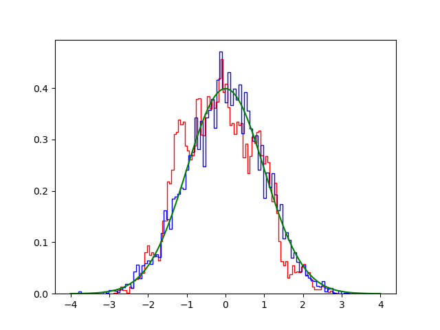
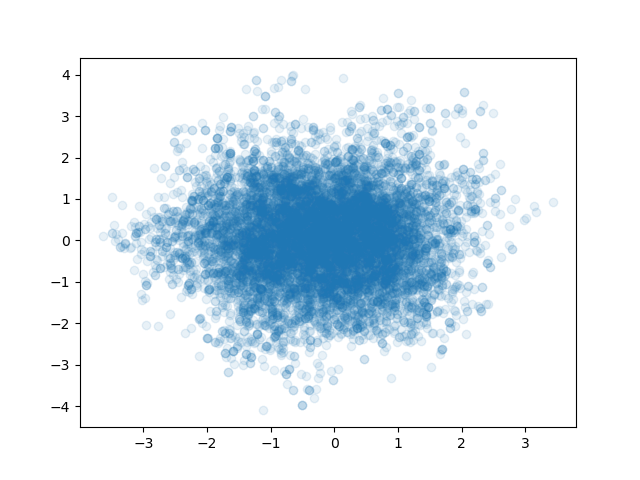
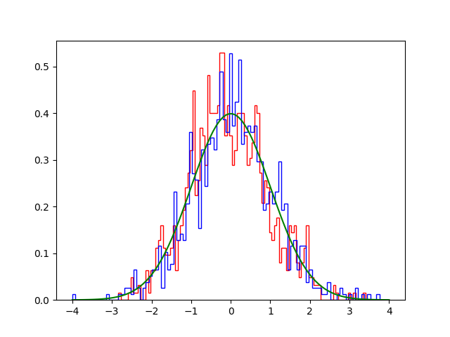

Examples
========

analitical.follow.py
------------------------
.. literalinclude:: ../examples/graph/analitical.follow.py
   :language: python

.. image:: ../examples/graph/analitical.follow.png

.. literalinclude:: ../examples/graph/analitical.follow.out
   :language: sh

analitical.py
------------------------
.. literalinclude:: ../examples/graph/analitical.py
   :language: python

.. image:: ../examples/graph/analitical.png

.. literalinclude:: ../examples/graph/analitical.out
   :language: sh

cmaes0.py
------------------------
.. literalinclude:: ../examples/graph/cmaes0.py
   :language: python

.. image:: ../examples/graph/cmaes0.png

.. literalinclude:: ../examples/graph/cmaes0.out
   :language: sh

coins.py
------------------------
.. literalinclude:: ../examples/graph/coins.py
   :language: python

.. image:: ../examples/graph/coins.png

.. literalinclude:: ../examples/graph/coins.out
   :language: sh

coins.vis.py
------------------------
.. literalinclude:: ../examples/graph/coins.vis.py
   :language: python

follow0.py
------------------------
.. literalinclude:: ../examples/graph/follow0.py
   :language: python

.. image:: ../examples/graph/follow0.png

follow1.py
------------------------
.. literalinclude:: ../examples/graph/follow1.py
   :language: python

.. image:: ../examples/graph/follow1.png

langevin0.py
------------------------
.. literalinclude:: ../examples/graph/langevin0.py
   :language: python

langevin1.py
------------------------
.. literalinclude:: ../examples/graph/langevin1.py
   :language: python

langevin2.py
------------------------
.. literalinclude:: ../examples/graph/langevin2.py
   :language: python

langevin3.py
------------------------
.. literalinclude:: ../examples/graph/langevin3.py
   :language: python

langevin4.py
------------------------
.. literalinclude:: ../examples/graph/langevin4.py
   :language: python

.. image:: ../examples/graph/langevin4.png

metropolis0.py
------------------------
.. literalinclude:: ../examples/graph/metropolis0.py
   :language: python

three.follow.py
------------------------
.. literalinclude:: ../examples/graph/three.follow.py
   :language: python

.. image:: ../examples/graph/three.follow.png

three.py
------------------------
.. literalinclude:: ../examples/graph/three.py
   :language: python

.. image:: ../examples/graph/three.png

three.vis.py
------------------------
.. literalinclude:: ../examples/graph/three.vis.py
   :language: python

tmcmc0.py
------------------------
.. literalinclude:: ../examples/graph/tmcmc0.py
   :language: python

tmcmc1.py
------------------------
.. literalinclude:: ../examples/graph/tmcmc1.py
   :language: python

tmcmc2.py
------------------------
.. literalinclude:: ../examples/graph/tmcmc2.py
   :language: python

.. image:: ../examples/graph/tmcmc2.png

smtmcmc.py
------------------------
.. literalinclude:: ../examples/sm/smtmcmc.py
   :language: python

